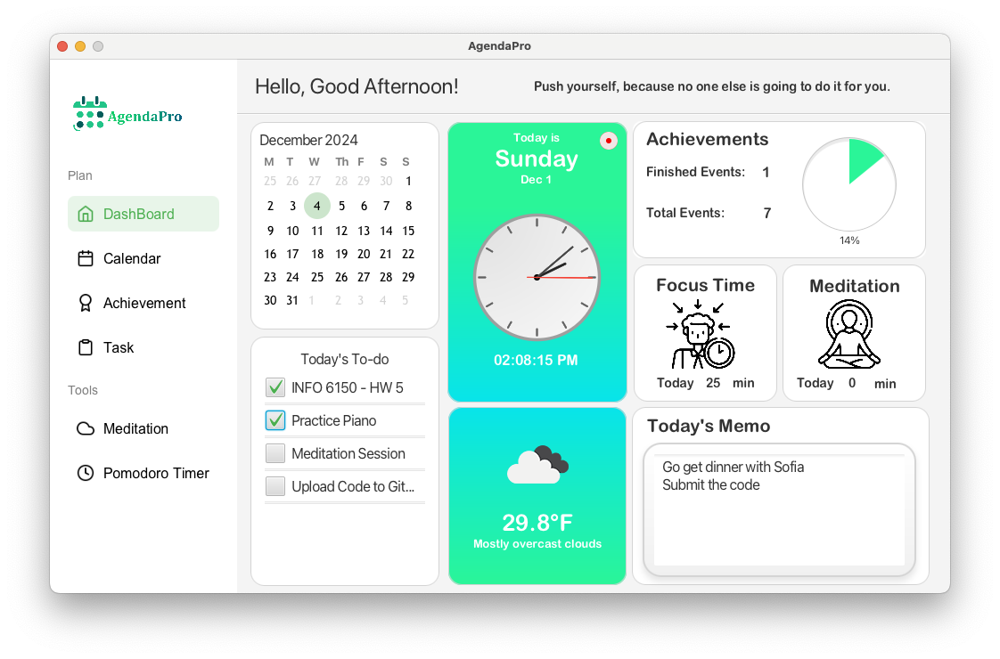

# AgendaPro: Your Ultimate Productivity Companion

## Project Overview

AgendaPro tackles modern productivity challenges by offering a holistic, user-centric platform. It combines dynamic scheduling, effective task management, focus-enhancing tools, achievement tracking, and even weather insights—all aimed at boosting time management, mental clarity, and personal growth. This tool not only helps users stay organized but also promotes overall well-being and confidence through positive reinforcement and actionable guidance.

---

## Demo



Explore AgendaPro's intuitive interface with features designed to streamline your productivity journey.

---

## Key Features

- **Dynamic Calendar**  
  Manage your events and appointments with ease using customizable **weekly and monthly views**. Add, edit, and track events seamlessly.  
- **Task Management**  
  Create, edit, and monitor daily to-dos. Include detailed notes and track task progress to stay on top of your responsibilities.  
- **Focus Tools**  
  - **Pomodoro Timer**: Boost productivity with structured work sessions.  
  - **Meditation Tracker**: Enhance relaxation and mental clarity.  
- **Achievement Tracking**  
  Celebrate your milestones to build positive habits and stay motivated.  
- **Weather Widget** *(New)*  
  View real-time weather updates directly in the app to plan your day better.

---

## Tools and Technologies

- **Programming**: JavaFX, SceneBuilder, Eclipse  
- **Version Control**: GitHub, Git  
- **Project Planning**: Notion, Trello  
- **Diagramming**: Lucidchart  
- **UI Assets**: Figma, Affinity Designer  

---

## How to Run

### 1. Clone the Project Repository
Clone the repository to your local machine using your preferred method (e.g., Git CLI or Git GUI).

### 2. Set Up JavaFX Libraries in Eclipse
1. Open Eclipse and navigate to your project.
2. Right-click on the project in the **Project Explorer** and select **Properties**.
3. Go to **Java Build Path** and switch to the **Libraries** tab.
4. Under **Modulepath**, click the **Add Library...** button.
5. Select **User Library**, then choose **JavaFX**, and click **Finish**.
6. Click **Apply** and then **Apply and Close**.
7. At this point, all errors in your project should be resolved.

### 3. Set JavaFX VM Arguments
1. Right-click on `Main.java` and navigate to **Run As > Run Configurations**.
2. In the **Run Configurations** dialog, select your project's main class under **Java Application**.
3. Go to the **Arguments** tab and locate the **VM Arguments** field.
4. Add the following line to the field:
   ```bash
   --add-modules javafx.controls,javafx.fxml

---

## Future Enhancements

- **Enhanced Event Management**: Add support for recurring events with precise start and end times down to the minute.  
- **Advanced Analytics**: Provide users with insights into their time allocation and productivity trends.  
- **Smart Notifications**: Integrate AI-powered reminders and motivational messages.  
- **Weather-Based Suggestions**: Combine weather insights with productivity tips for better daily planning.
